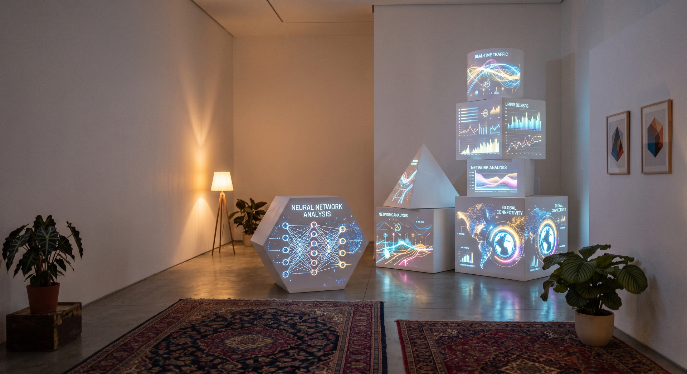
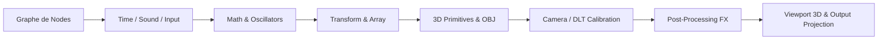

# 🌐 OpenVMap3D

<div align="center">



**Moteur de Studio 3D & Node Graph Temps Réel pour le Video-Mapping, la Data-Visualisation et les Arts Numériques**

[](https://tauri.app/)
[](https://threejs.org/)
[](https://react.dev/)
[](https://www.typescriptlang.org/)
[](https://vitejs.dev/)
[](https://vitest.dev/)
[](LICENSE)

[Fonctionnalités](#-fonctionnalités-clés) • [Architecture](#-architecture-du-graphe--système-de-nodes) • [Catalogue des Nodes](#-catalogue-complet-des-nodes) • [Calibration DLT](#-calibration-vidéo-mapping-3d-dlt) • [Raccourcis Clavier](#-raccourcis-clavier) • [Installation](#-installation--démarrage)

</div>

---

## 📖 À propos d'OpenVMap3D

**OpenVMap3D** est une application desktop haute performance construite avec **Tauri 2**, **React 18** et **Three.js**. Conçue spécifiquement pour les installations de vidéo-mapping 3D, la scénographie numérique, la visualisation de données temps réel et les interactions immersives (IoT, audio réactif, capteurs).

Contrairement aux outils traditionnels basés sur une approche impérative ou des fenêtres rigides, OpenVMap3D s'appuie sur un **moteur de graphe de nodes 100% réactif** inspiré de *Blender Geometry Nodes* et *Cables.gl*. Chaque aspect de la scène 3D — géométries, matériaux, lumières, animations, entrées audio, physiques de particules et post-processeurs — est piloté dynamiquement par le flux de données du graphe.

---

## ✨ Fonctionnalités Clés

### 🎨 Moteur Rendu 3D & Éclairage PBR Temps Réel
* **Primitives 3D Génératives** : `Box`, `Plane`, `Sphere`, `Disc`, `Cylinder`, `Cone`, `Text 3D Extrudé` (typographies vectorielles), `Bar Graph` dynamique.
* **Importateur de Modèles 3D** : Chargement natif des fichiers `.obj` complexes avec gestion multi-matériaux et transparence.
* **Éclairage Réaliste & Ombre** : Support natif des lumières `Directional`, `Point`, `Spot` et `Ambient` avec cartes d'ombres GPU dynamiques.
* **Environnement HDRI / EXR 32-bit** : Éclairage d'environnement PBR basé sur des cartes HDRI (`.hdr`) et OpenEXR (`.exr`) 32 bits flottants avec contrôle de flou d'arrière-plan (`backgroundBlurriness`).
* **Opacité & Transparence Universelles** : Réglage d'opacité `Opacity` ($0.0 \to 1.0$) sur l'intégralité des objets 3D et primitives avec gestion de la transparence alpha GPU.

### 🔁 Instanciation & Matrice de Duplication (Array)
* **Distributions N-Dimensionnelles** :
  - `Linear` : Alignement 1D selon les axes $X$, $Y$ ou $Z$ avec espacement dynamique.
  - `Circular` : Répartition sur cercle 3D avec orientation tangentielle automatique et choix des plans (`XZ`, `XY`, `YZ`).
  - `Grid` : Matrice 2D paramétrable avec espacements indépendants $X$/$Y$ et option de centrage sur l'origine.
  - `3D Grid` : Volume 3D à 3 dimensions ($X \times Y \times Z$) pour générer des cubes ou grilles volumétriques d'instances.
* **Nodes d'Instanciation d'Objets** : `Set Instance Transform`, `Set Instance Color`, `Get Instance` pour manipuler chaque instance individuellement via des listes de vecteurs, de matrices ou de couleurs.

### 📐 Calibration Vidéo-Mapping 3D Directe (DLT)
* **Direct Linear Transformation (DLT)** : Calibrage géométrique temps réel de la vidéo-projection en comparant le modèle 3D aux coins physiques de la pièce.
* **Poignées de Calage Interactives** : Glissez-déposez les 6 repères physiques (`Room Corner`) directement sur la caméra pour calculer instantanément la position exacte du projecteur, sa rotation, son champ de vision (FOV) et son décalage d'objectif (*lens shift*).

### 🎬 Pipeline de Post-Traitement GPU
* **Chaîne Post-Process Évoluée** : `Bloom` (lumière émissive/glowing), `Depth of Field (DoF)`, `Film Grain`, `Vignette`, `Outline` (détection de contours), `Pixelate`, `Glitch`, `Kaleidoscope`, `RGB Shift`, `Antialias` (FXAA/SMAA), `Color Correction`.
* **Exclusion d'Interface** : Les grilles 3D, repères de gizmos et poignées de calage sont automatiquement exclus du pipeline de post-traitement pour un rendu final pur.

### 🎵 Audio Réactif & Entrées Temps Réel
* **Entrées Audio Live** : Capture microphone temps réel (`Microphone Input`), Analyseur de spectre FFT (`Audio Spectrum`), Détecteur de crêtes (`Audio Peak Detector`), Lecteur Audio (`Audio Player`) et Synthétiseur (`Audio Synth`).
* **Oscillateurs & Signaux** : Nodes `Time`, `Oscillator` (Sinus, Carré, Dent de scie, Triangle), `Envelope` et `Random Value` pour synchroniser les visuels sur le rythme ou la musique.

### 🎛️ Système de Particules
* **Particules Temporelles** : Emetteur de particules `Particle Emitter`, simulateur de champs `Particle Simulate` et rendu `Particle Render` pour des effets de poussière, feu, fumée ou pluie réactifs.

---

## 🏛️ Architecture du Graphe & Système de Nodes

Le graphe d'OpenVMap3D repose sur un moteur d'évaluation réactif sans boucle infinie (*DAG - Directed Acyclic Graph*), garantissant une exécution fluide à 60+ FPS.



### 🏷️ Types de Sockets Supportés
* 🟡 **`Value`** : Nombre flottant scalaire.
* 🟢 **`Vector`** : Vecteur 3D $(x, y, z)$.
* 🔵 **`Matrix`** : Matrice de transformation $4 \times 4$.
* 🔴 **`Color`** : Couleur RGBA (Hex, HSL, RGB).
* 🟣 **`Geometry`** : Maillage / Mesh 3D Three.js.
* 🟠 **`Texture`** : Carte d'image, canevas ou flux d'environnement.
* ⚪ **`List`** : Collection ordonnée de n'importe quel type ci-dessus.
* 🔘 **`Any`** : Socket polymorphe s'adaptant automatiquement au type connecté.

---

## 📚 Catalogue Complet des Nodes

OpenVMap3D contient **plus de 60 nodes spécialisées** réparties en 10 catégories :

### 🏗️ Structure & Géométrie

> Tous les nodes objets sortent leur géométrie **et** leur pose locale sur une sortie `Matrix` — à brancher directement dans `Distance`, `Proximity Object`, `Pivot` ou `Look At`.

| Node | Description |
| :--- | :--- |
| `Box` | Cube / Parallélépipède 3D paramétrable avec opacité et textures. |
| `Plane` | Plan 2D dans l'espace 3D avec plaquage de texture UV. |
| `Sphere` | Sphère 3D géométrique avec résolution UV. |
| `Disc` | Disque / Cercle 2D ou cylindre plat. |
| `Cylinder` | Cylindre 3D géométrique. |
| `Cone` | Cône 3D géométrique. |
| `Text 3D` | Texte 3D extrudé avec contours vectoriels et choix de polices. |
| `Bar Graph` | Graphique en barres 3D dynamique piloté par une liste de valeurs. |
| `OBJ Model` | Chargeur de fichier modèle 3D au format `.obj`. |
| `Array` | Duplicateur d'instances en mode Linear (1D), Circular (2D), Grid (2D) ou 3D Grid (Volume). |
| `Merge` | Fusionne plusieurs sous-graphes géométriques en un seul assemblage. |
| `Set Instance Transform` | Applique des transformations relatives/absolues (position, rotation, échelle, matrice) sur des instances. Entrée `Index` pour ne cibler qu'une seule instance (`-1` = toutes). |
| `Set Instance Color` | Applique des couleurs individuelles sur une collection d'instances à partir d'une liste. Entrée `Index` pour ne cibler qu'une seule instance (`-1` = toutes). |
| `Get Instance` | Extrait une instance spécifique d'un groupe d'instances par son index. |
| `Geometry Transform` | Applique une transformation directe sur une géométrie 3D sans passer par la scène. |

### 📽️ Caméra & Calibration
| Node | Description |
| :--- | :--- |
| `Camera` | Caméra 3D avec modes Perspective, Orthographique et Calibration DLT Temps Réel. |
| `Room Corner` | Modèle 3D de la pièce physique (Mur A, Mur B, Hauteur) générant les 6 repères de calage. |

### 💡 Éclairage & Environnement
| Node | Description |
| :--- | :--- |
| `Directional Light` | Lumière directionnelle (type soleil) avec ombres portées. |
| `Point Light` | Lumière ponctuelle omnisource avec portée et atténuation. |
| `Spot Light` | Lumière conique orientable avec angle de pénombre et ombres. |
| `Ambient Light` | Lumière d'ambiance uniforme pour déboucher les ombres. |
| `Environment & HDRI` | Carte d'environnement HDRI (`.hdr`) ou OpenEXR (`.exr`) 32-bit avec flou réglable. |

### 🖼️ Textures & Matériaux
| Node | Description |
| :--- | :--- |
| `Image Texture` | Chargeur d'image bitmap (PNG, JPEG, WebP) pour plaquage de texture. |
| `Texture Plane` | Générateur de plan texturé 2D rapide. |
| `Texture Transform` | Translation, rotation et échelle des coordonnées UV de texture. |

### ⚙️ Post-Traitement & Effets GPU
| Node | Description |
| :--- | :--- |
| `Bloom` | Effet d'émanation lumineuse (glowing / émissivité). |
| `Depth of Field (DoF)` | Flou de profondeur de champ cinématique. |
| `Film Grain` | Grain de film argentique analogique. |
| `Vignette` | Assombrissement des coins de l'image. |
| `Outline` | Détection de contours et rendu toon/cel-shading. |
| `Pixelate` | Mosaïque de pixellisation rétro. |
| `Glitch` | Artefacts d'aberration numérique et décalage de balayage. |
| `Kaleidoscope` | Effet miroir symétrique rotatif. |
| `RGB Shift` | Aberration chromatique (séparation des canaux Rouge/Vert/Bleu). |
| `Antialias` | Lissage des bords de polygones (FXAA / SMAA). |
| `Color Correction` | Ajustement du contraste, de la saturation et de la luminosité. |

### 🧮 Mathématiques, Logique & Vecteurs
| Node | Description |
| :--- | :--- |
| `Value Math` | Opérations arithmétiques (+, -, *, /, mod, pow, min, max, sin, cos). |
| `Map Range` | Remappage linéaire ou clamped d'une plage de valeurs $[min_1, max_1] \to [min_2, max_2]$. |
| `Vector Math` | Addition, soustraction, produit vectoriel, produit scalaire, normalisation. |
| `Vector Compose / Decompose` | Assemblage et séparation des composantes $(x, y, z)$. |
| `Distance` | Distance euclidienne 3D entre deux vecteurs, objets, matrices ou listes. |
| `Proximity Object` | Instance la plus proche d'une cible dans une liste ou un pack d'instances (objet, distance, index, position). |
| `Color Math` | Mélange, addition et multiplication de couleurs RGBA. |
| `Boolean Logic` | Opérateurs booléens AND, OR, NOT, XOR. |
| `Compare` | Comparateurs $(<, \le, >, \ge, ==, \neq)$. |
| `Gate / Toggle / Trigger` | Portes logiques, bascules bistables et détecteurs de front montant. |

### 🎵 Audio Réactif & Entrées
| Node | Description |
| :--- | :--- |
| `Microphone Input` | Capture l'entrée audio du microphone du système en temps réel. |
| `Audio Spectrum` | Extrait les bandes de fréquences FFT (basses, médiums, aigus). |
| `Audio Player` | Lecteur de fichier audio avec contrôle de lecture et vitesse. |
| `Audio Peak Detector` | Détecte les impacts / beats de batterie et de basse. |
| `Audio Synth` | Générateur de sons synthétiques et fréquences audio. |

### ⏱️ Temps, Oscillateurs & Hasard
| Node | Description |
| :--- | :--- |
| `Time` | Horloge temps réel (secondes, delta time, frame count). |
| `Oscillator` | Générateur d'ondes répétitives (Sinus, Carré, Dent de scie, Triangle). |
| `Envelope` | Enveloppe d'attaque et de décroissance (ADSR). |
| `Random Value` | Générateur de nombres aléatoires flottants ou entiers. |
| `Random Vector` | Générateur de vecteurs 3D aléatoires dans une sphère ou un cube. |
| `Random List` | Liste de valeurs ou couleurs aléatoires. |

### 📋 Listes & Fichiers de Données
| Node | Description |
| :--- | :--- |
| `CSV Reader` | Importateur de fichiers de données CSV pour la data-visualisation. |
| `Generate List` | Génère une liste de nombres en progression arithmétique. |
| `Slice List` | Extrait une sous-section d'une liste par index. |
| `List Math` | Applique des opérations mathématiques sur l'ensemble des éléments d'une liste. |
| `Combine Vector Lists` | Assemble des listes scalaires $X$, $Y$, $Z$ en une liste de vecteurs. |
| `Get List Item` | Extrait un élément spécifique d'une liste par son index. |

---

## 🎯 Calibration Vidéo-Mapping 3D (DLT)

Le processus de calibration vidéo-mapping d'OpenVMap3D repose sur la méthode **Direct Linear Transformation (DLT)**. Il permet d'aligner parfaitement la projection virtuelle 3D sur le volume réel de la pièce :

```
                                 [ Projecteur Réel ]
                                         │
                                         ▼
[ Modèle 3D Room Corner ] ───▶ [ 6 Poignées de Calage ] ───▶ [ Solveur DLT ]
 (Mesures au mètre ruban)       (Ajustement à la souris)      (Position + FOV + Lens Shift)
```

1. **Mesurez la pièce** : Saisissez la largeur du Mur A, du Mur B et la hauteur sous plafond dans la node `Room Corner`.
2. **Reliez la caméra** : Branchez la sortie `Ref Points` de `Room Corner` sur l'entrée `Ref Points` de la node `Camera`.
3. **Calibrez à l'écran** : Ouvrez l'overlay de calibration de la caméra et glissez chacune des 6 poignées colorées sur les coins réels correspondants dans votre projection.
4. **Résolution automatique** : Le solveur DLT calcule instantanément la position exacte du projecteur dans l'espace 3D !

---

## ⌨️ Raccourcis Clavier

| Raccourci | Action |
| :--- | :--- |
| <kbd>Tab</kbd> | Masque / Affiche l'interface 3D de travail (Grille au sol, Axes, Gizmos de transformation, Repères de lumière). |
| <kbd>Cmd</kbd> + <kbd>Z</kbd> / <kbd>Ctrl</kbd> + <kbd>Z</kbd> | **Annuler (Undo)** la dernière modification du graphe (historique 50 étapes). |
| <kbd>Cmd</kbd> + <kbd>Shift</kbd> + <kbd>Z</kbd> / <kbd>Ctrl</kbd> + <kbd>Y</kbd> | **Rétablir (Redo)** la modification annulée. |
| <kbd>Shift</kbd> + <kbd>A</kbd> ou <kbd>Espace</kbd> | Ouvre le **Recherche Rapide de Nodes** pour ajouter une node au curseur. |
| <kbd>Suppr</kbd> / <kbd>Backspace</kbd> | Supprime les nodes ou liaisons sélectionnées. |
| <kbd>Cmd</kbd> + <kbd>C</kbd> / <kbd>Cmd</kbd> + <kbd>V</kbd> | Copier / Coller les nodes sélectionnées. |
| <kbd>Cmd</kbd> + <kbd>D</kbd> | Dupliquer les nodes sélectionnées. |

---

## 🚀 Installation & Démarrage

### Prérequis
* [Node.js](https://nodejs.org/) (version 18 ou supérieure)
* [Rust](https://www.rust-lang.org/) (pour la compilation du backend Tauri 2)
* [pnpm](https://pnpm.io/) ou `npm`

### 1. Cloner le Projet
```bash
git clone https://github.com/Nikos-Unilasalle/openVMap3D.git
cd openVMap3D
```

### 2. Installer les Dépendances
```bash
npm install
```

### 3. Lancer en Mode Développement (Vite Web App)
```bash
npm run dev
```

### 4. Lancer l'Application Desktop Tauri
```bash
npm run tauri dev
```

### 5. Exécuter la Suite de Tests Unitaires
```bash
npx vitest run
```

### 6. Compiler l'Application pour la Production
```bash
npm run build
npm run tauri build
```

---

## 🛠️ Technologies & Bibliothèques

* **Framework Application** : [Tauri v2](https://tauri.app/) (Rust Backend + Web Frontend).
* **Moteur Graphique 3D** : [Three.js r170](https://threejs.org/) + `EXRLoader` + `RGBELoader` + `OBJLoader`.
* **Interface Utilisateur** : [React 18](https://react.dev/) + [TypeScript 5.6](https://www.typescriptlang.org/).
* **Éditeur de Graphe** : [@xyflow/react (React Flow v12)](https://reactflow.dev/).
* **Build System & Bundler** : [Vite 7.3](https://vitejs.dev/).
* **Suite de Tests** : [Vitest 4.1](https://vitest.dev/).

---

## 📄 Licence

Ce projet est sous licence **MIT**. Voir le fichier [LICENSE](LICENSE) pour plus de détails.

---

<div align="center">
Créé avec ❤️ pour la communauté des arts numériques, de la scénographie et du vidéo-mapping 3D.
</div>
