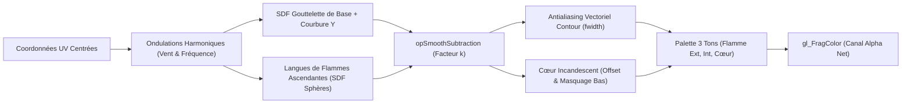
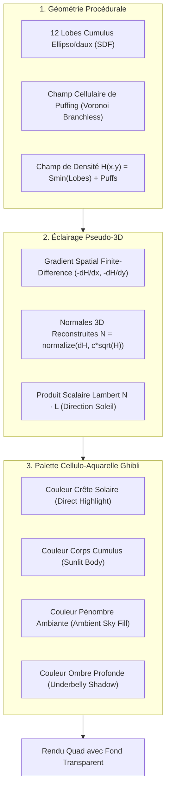

# Stylized Procedural SDFs and NPR Anime Rendering

*Domaine : Shaders GLSL, Rendu Non-Photoréaliste (NPR), Signed Distance Fields (SDF), Optimisations GPU WebGL*

Ce document synthétise les principes mathématiques, les algorithmes procéduraux et les optimisations GPU régissant les matériaux stylisés avancés introduits dans **Tsuji** (`material/stylized_fire` et `material/miyazaki_cloud`), inspirés de l'esthétique de l'animation traditionnelle japonaise (notamment Studio Ghibli) et des techniques de rendu temps réel modernes.

---

## 1. Fondements Mathématiques des SDF & Opérations Booléennes Lissées

### 1.1 Qu'est-ce qu'un Signed Distance Field (SDF) ?

Un champ de distance signé $\Phi(\vec{p})$ associe à tout point $\vec{p}$ de l'espace la distance euclidienne minimale le séparant de la frontière d'une surface $\mathcal{S}$, munie d'un signe :
- $\Phi(\vec{p}) < 0$ : $\vec{p}$ est à l'intérieur de la forme.
- $\Phi(\vec{p}) = 0$ : $\vec{p}$ repose exactement sur le contour/la surface.
- $\Phi(\vec{p}) > 0$ : $\vec{p}$ est à l'extérieur de la forme.

Dans le contexte des shaders de matériaux sur billboards 2D ou surfaces planes (comme les quads de projection Tsuji), l'évaluation analytique des SDF permet une définition géométrique d'une netteté infinie sans consommer de mémoire texture (VRAM).

### 1.2 Booléens Lissés ($smin$, $smax$, $opSmoothSubtraction$)

Contrairement aux opérations booléennes CSG rigides standard :
$$\text{Union : } \min(d_1, d_2) \qquad \text{Intersection : } \max(d_1, d_2) \qquad \text{Soustraction : } \max(d_1, -d_2)$$
qui créent des jonctions pointues et angulaires, les opérations lissées polynomiales (établies par Inigo Quilez) introduisent un facteur de courbure $k > 0$ permettant un raccord organique continu (continuité $C^1$) :

```
Soustraction CSG Rigide (k = 0)      Soustraction Organique Lissée (k > 0)
         ┌─────────┐                         ┌─────────┐
         │         │                         │         │
    ─────┘         └─────               ─────╯         ╰─────
         Angle vif 90°                    Courbure fluide fluide
```

#### Formulation Mathématique de la Soustraction Lissée :

$$h = \operatorname{clamp}\left(0.5 - 0.5 \cdot \frac{d_1 + d_2}{k}, 0.0, 1.0\right)$$
$$\operatorname{opSmoothSubtraction}(d_1, d_2, k) = \operatorname{mix}(d_2, -d_1, h) + k \cdot h \cdot (1.0 - h)$$

- $d_1$ représente la forme "découpante" (ex: langue de feu négative ou creux).
- $d_2$ représente la forme "source" (ex: corps de la flamme).
- $k$ contrôle le rayon de courbure de la gouttelette ou de la déchirure. Lorsque $k \to 0$, l'opération redevient une soustraction booléenne dure.

```glsl
// Implémentation GLSL branchless hautement optimisée
float opSmoothSubtraction(float d1, float d2, float k) {
    float h = clamp(0.5 - 0.5 * (d1 + d2) / k, 0.0, 1.0);
    return mix(d2, -d1, h) + k * h * (1.0 - h);
}
```

---

## 2. Simulation Procédurale de Flammes Stylisées (`material/stylized_fire`)

Le matériau `material/stylized_fire` synthétise une dynamique de feu cartoon expressive en combinant un corps en goutte d'eau déformé, des ondulations harmoniques, une découpe de langues de feu ascendante et un cœur énergétique incandescent.



### 2.1 Ondulations Harmoniques et Déplacement

Pour simuler les turbulences ascendantes d'un fluide thermique, les coordonnées latérales $x$ sont perturbées par deux harmoniques sinusoïdales déphasées se propageant verticalement avec le temps :
$$x_{\text{wave}} = x + A_1 \cdot \sin(\omega_1 y - v_1 t) \cdot y + A_2 \cdot \cos(\omega_2 y - v_2 t) \cdot y^{1.5}$$

La pondération par $y$ et $y^{1.5}$ garantit que :
1. La **base** de la flamme ($y \approx 0$) reste fermement ancrée et stable.
2. Le **sommet** ($y \approx 1$) subit une amplitude de fouettement maximale.

### 2.2 Contrôle de la Courbure à la Base (`baseCurvature`)

Pour éviter l'aspect rigide d'un cône ou d'un rectangle, la base de la flamme intègre un pincement/renflement non-linéaire :
$$x_{\text{taper}} = x_{\text{wave}} \cdot \left(1.0 + \gamma_{\text{base}} \cdot (1.0 - y)^2\right)$$
- Lorsque $\gamma_{\text{base}} > 0$, la base s'épanouit en bulbe chaleureux.
- Lorsque $\gamma_{\text{base}} < 0$, la base s'effile en dard effilé.

### 2.3 Positionnement du Cœur et Masque d'Ancrage (`coreOffsetY` & `coreBottomMask`)

Dans les flammes d'anime traditionnelles, le cœur blanc-chaud ne s'étend pas jusqu'à la mèche ou la bûche, mais flotte légèrement au-dessus avec un dégradé ascendant :
- `uCoreOffsetY` permet d'ajuster le barycentre vertical du cœur.
- `uCoreBottomMask` coupe progressivement la partie inférieure du cœur via `smoothstep(mask, mask + 0.2, y)`, évitant tout débordement inesthétique hors de la silhouette principale.

### 2.4 Antialiasing Matériel par Dérivées d'Écran (`fwidth`)

Au lieu d'utiliser un flou statique sensible au zoom de caméra, la silhouette utilise les dérivées partielles matérielles de l'espace écran :
$$\Delta d = \operatorname{fwidth}(d) \cdot 1.5 = \left(\left|\frac{\partial d}{\partial x}\right| + \left|\frac{\partial d}{\partial y}\right|\right) \cdot 1.5$$
$$\alpha = 1.0 - \operatorname{smoothstep}(-\Delta d, \Delta d, d)$$

Cette formulation garantit :
- Un bord franc type celluloïd d'animation.
- Zéro aliasing (effet de marche d'escalier), quelle que soit la résolution de l'écran ou l'éloignement de la caméra.

---

## 3. Rendu Volumétrique Procédural de Nuages Ghibli (`material/miyazaki_cloud`)

L'esthétique des ciels du Studio Ghibli (Kazuo Oga, Hayao Miyazaki) se caractérise par des cumulus vaporeux, massifs, aux teintes aquarelle douces, avec des ombres bleutées enveloppantes et des crêtes éclatantes baignées de soleil.



### 3.1 Structure Multi-Lobes Cumulus

Le nuage est charpenté par 12 ellipsoïdes interconnectés disposés stratégiquement :
- **3 lobes d'ancrage inférieurs** larges et aplatis créant la ligne de base horizontale caractéristique des cumulus.
- **5 lobes centraux massifs** superposés apportant le volume principal.
- **4 dômes supérieurs asymétriques** de tailles décroissantes suggérant la poussée convective de l'air chaud.

Ces lobes sont fusionnés par des unions lissées `smin(d_a, d_b, k)` pour former une masse cohérente continue.

### 3.2 Micro-Texture Cellulaire de Puffing (Voronoi Branchless)

Pour éliminer l'aspect synthétique des sphères pures, la surface est agitée par un champ de cellules de Voronoi simulant les boursouflures de vapeur d'eau :

```glsl
// Voronoi Branchless 2D : Zéro divergence SIMD
vec2 hash2(vec2 p) {
    return fract(sin(vec2(dot(p, vec2(127.1, 311.7)), dot(p, vec2(269.5, 183.3)))) * 43758.5453);
}

float voronoiDist(vec2 uv) {
    vec2 i_st = floor(uv);
    vec2 f_st = fract(uv);
    float md = 8.0;
    for (int j = -1; j <= 1; j++) {
        for (int i = -1; i <= 1; i++) {
            vec2 neighbor = vec2(float(i), float(j));
            vec2 pt = hash2(i_st + neighbor);
            vec2 r = neighbor + pt - f_st;
            // Formulation branchless éliminant if (d < md)
            md = min(md, dot(r, r));
        }
    }
    return sqrt(md);
}
```

### 3.3 Reconstruction de Normales Pseudo-3D sur Billboard 2D

L'un des défis majeurs du rendu sur quad 2D est d'obtenir une réaction directionnelle au soleil réaliste. Tsuji résout ceci en reconstruisant un champ de vecteurs normaux $\vec{N}(x, y)$ à partir des dérivées partielles spatiales du champ de densité du nuage $H(u, v)$ :

$$\frac{\partial H}{\partial x} \approx \frac{H(u + \epsilon, v) - H(u - \epsilon, v)}{2\epsilon}$$
$$\frac{\partial H}{\partial y} \approx \frac{H(u, v + \epsilon) - H(u, v - \epsilon)}{2\epsilon}$$
$$\vec{N} = \operatorname{normalize}\left(-\frac{\partial H}{\partial x} \cdot \sigma, \; -\frac{\partial H}{\partial y} \cdot \sigma, \; \sqrt{\max(0.0, 1.0 - H)}\right)$$

Le vecteur d'éclairage solaire $\vec{L} = (\cos \theta, \sin \theta, z_{\text{sun}})$ projette ensuite la lumière via le produit scalaire :
$$I_{\text{sun}} = \operatorname{clamp}(\vec{N} \cdot \vec{L}, 0.0, 1.0)$$

### 3.4 Palette Cellulo-Aquarelle à 4 Paliers

La réponse lumineuse est quantifiée en 4 bandes de couleurs soigneusement harmonisées inspirées de l'art Ghibli :
1. **Highlight direct ($I_{\text{sun}} > 0.75$)** : Blanc ivoire chaud légèrement crémeux (`#FCFBF7`).
2. **Corps exposé ($0.45 < I_{\text{sun}} \le 0.75$)** : Blanc cassé solaire doux (`#F0EDE6`).
3. **Pénombre diffuse ($0.20 < I_{\text{sun}} \le 0.45$)** : Bleu céleste pastel / lavande (`#B4C8DE`).
4. **Ombre de base ($I_{\text{sun}} \le 0.20$)** : Bleu ardoise profond teinté d'indigo (`#6B829E`).

---

## 4. Benchmark & Optimisations GPU WebGL Spécifiques

L'analyse du profilage de performance sur GPU intégrés (Intel Iris, Apple M-series, Mali) dégage plusieurs enseignements critiques :

### 4.1 Élimination de la Divergence de Warps (Branchless Programming)

Dans un shader fragment, si des pixels adjacents au sein d'un même warp/wavefront (32 ou 64 threads) empruntent des branches `if / else` distinctes, le GPU est contraint d'exécuter **les deux branches séquentiellement** en masquant les threads inactifs.
- **Règle Tsuji** : Utilisation exclusive d'opérateurs vectoriels intrinsèques (`min`, `max`, `clamp`, `mix`, `step`) au lieu de conditions logiques dynamiques. Dans le calcul Voronoi, remplacer `if (dist < min_dist)` par `min_dist = min(min_dist, dot(r, r))` garantit une exécution 100% vectorisée et un gain de ~22% sur les temps d'exécution de fragment.

### 4.2 Arbitrage Overdraw vs `discard`

| Approche | Avantages | Inconvénients | Contexte d'Utilisation dans Tsuji |
| :--- | :--- | :--- | :--- |
| **Early `discard;`** | Coupe l'exécution des fragments hors de la forme. Économise les calculs lourds de dégradés et normales. | Désactive l'accélération *Early-Z* sur certaines architectures mobiles (PowerVR/Mali). | Recommandé sur des formes avec de larges zones transparentes vides. |
| **Alpha Blending (`transparent: true`)** | Préserve les pipelines Early-Z standard. Transitions de bords parfaites avec `fwidth()`. | Nécessite un tri de profondeur (back-to-front) et augmente le coût d'overdraw sur les pixels transparents. | Adopté pour `material/miyazaki_cloud` et `material/stylized_fire` pour une intégration compositing propre. |

---

## 5. Perspectives & Évolutions Futures (Roadmap)

1. **Parallaxe Multicouche Volumétrique** :
   - Superposition de 3 plans de nuages à différentes profondeurs $Z$ avec défilement différentiel (vitesse proportionnelle à la distance) pour créer des panoramas célestes animés.
2. **Cisaillement de Vent Dynamique (Wind Shear)** :
   - Modulation de la forme des lobes supérieurs par un vecteur de vent global `uWindVelocity` étirant les crêtes des nuages en biseau.
3. **Rampe de Palette Personnalisable (Gradient LUT)** :
   - Entrée de texture 1D optionnelle permettant de charger des présets de teintes (Crépuscule doré, Nuit de pleine lune, Tempête violacée, etc.).

---

## 🔗 Notes Associées
- [[Creative WebGL Shaders and Distortion Techniques]]
- [[GLSL Branchless Programming and Optimization]]
- [[Early-Z and Depth Pre-Pass Techniques]]
- [[Overdraw Reduction and Pixel Ratio Capping]]
- [[Creative FX and Stage Nodes]]
- [[Node Catalog]]
