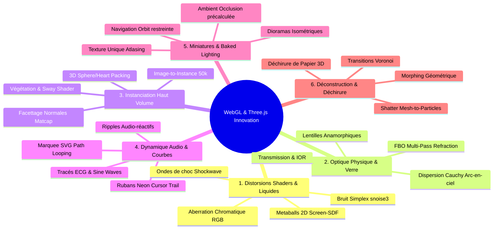

# ThreeJS Creative Showcase Synthesis and Node Ideas

*Domaine : Veille Technologique, Analyse des Tendances WebGL, Architecture Nodule & R&D Tsuji*

Cette note maîtresse capitalise sur l'analyse approfondie de plus de 160 cas d'usage et démonstrations Three.js de pointe (répertoriés sur FreeFrontend et Codrops) pour en extraire les patterns techniques récurrents et formuler la feuille de route des nouveaux nœuds du moteur **Tsuji**.

---

## 1. Les 6 Grands Piliers Visuels du WebGL Moderne

L'analyse transversale des démonstrations les plus innovantes met en évidence 6 archétypes visuels et algorithmiques majeurs :

---

## 2. Synthèse Comparative des Techniques Analysées

| Technique Étudiée | Référence Démo | Complexité GPU | Complexité CPU | Opportunité pour Tsuji |
| :--- | :--- | :--- | :--- | :--- |
| **Dispersion Chromatique Radiale** | *Chromatic Aberration Sine Wave* | Faible ($\mathcal{O}(1)$ fragment) | Nulle | Nœud `postprocess/rgb_wave` |
| **Image-to-Instance Matrix** | *Scroll-Driven Particle Image Matrix* | Moyenne (50k instances) | Faible (texture GPU) | Nœud `instance/texture_sampler` |
| **Verre Diélectrique & Réfraction** | *3D Glass Photo Lens* | Moyenne (1 FBO pass) | Nulle | Nœud `material/glass_refraction` |
| **Metaballs en Screen-Space** | *Metaballs Hero / Droplet Metaballs* | Faible-Moyenne (SDF) | Nulle | Nœud `geometry/metaballs_sdf` |
| **Ruban & Traînée Neon Fluide** | *Neon 3D Tubes Cursor Trail* | Faible (Spline tube) | Faible (Points buffer) | Nœud `motion/ribbon_trail` |
| **Déchirure Procédurale de Maillage** | *Tearing Paper Photo Gallery* | Moyenne (Mesh splitting) | Moyenne (Geometry update)| Nœud `modifier/tear_mesh` |
| **Onde Réfractive Audio-Réactive** | *Water Ripple Audio Input* | Faible (Shader Pass) | Nulle (FFT Uniform) | Nœud `postprocess/ripple_audio` |
| **Halo Émissif sans Bloom** | *Glow Effect Without Bloom* | Très Faible | Nulle | Nœud `material/glow_fresnel` |
| **Facettes Miroirs sur Normales** | *Matcap Instanced Disco Geometry*| Faible (InstancedMesh) | Init unique | Nœud `instance/normal_orient` |

---

## 3. Plan d'Implémentation & Nouveaux Nœuds Recommandés

### 🧩 Pôle Shading & Post-Process
- **`postprocess/shockwave`** : Générateur d'ondes de choc concentriques déclenchées par triggers ou transitoires audio FFT.
- **`postprocess/liquid_displacement`** : Morphing et distorsion liquide basés sur Simplex noise 3D et décalage d'UV.
- **`material/glass_refraction`** : Matériau de verre physique avec réfraction de scène d'arrière-plan, épaisseur et dispersion chromatique de Cauchy.
- **`material/glow_fresnel`** : Effet de halo émissif ultra-léger par inversion de normales et falloff de Fresnel, sans le coût de l'`UnrealBloomPass`.

### 🧩 Pôle Instanciation & Géométrie
- **`instance/texture_sampler`** : Générateur d'instances piloté par les pixels d'une image/vidéo (position Z, rotation, couleur, scale).
- **`instance/normal_orient`** : Disposition et orientation automatique de micro-facettes sur la surface et les normales d'un maillage hôte.
- **`mesh/shatter_particles`** : Déconstruction d'un maillage polygonal en un nuage de fragments particulaires animés.

### 🧩 Pôle Mouvement, Audio & Courbes
- **`motion/ribbon_trail`** : Générateur de ruban extrudé 3D continu suivant une trajectoire ou le curseur avec dégradé d'émission.
- **`sound/ripple_plane`** : Surface maillée déformée en temps réel par les bandes d'énergie FFT et transitoires sonores.

---

## 🔗 Notes Associées
- [[Creative WebGL Shaders and Distortion Techniques]]
- [[Optical Glass Refraction and Dispersion Shaders]]
- [[Advanced Instancing and Attribute-Driven Shading]]
- [[ShaderFX Nodes and Transition Pipeline]]
- [[Kinetic Audio and Path Dynamics]]
